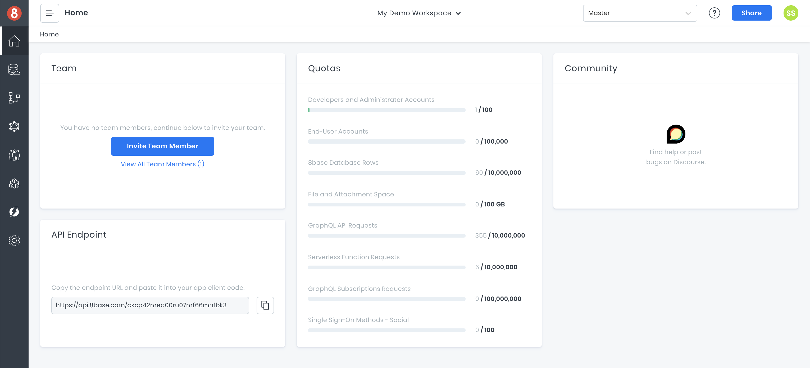
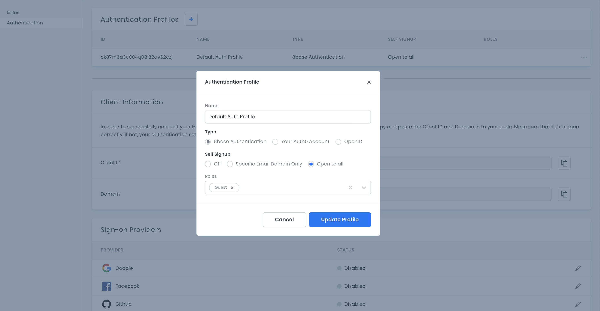
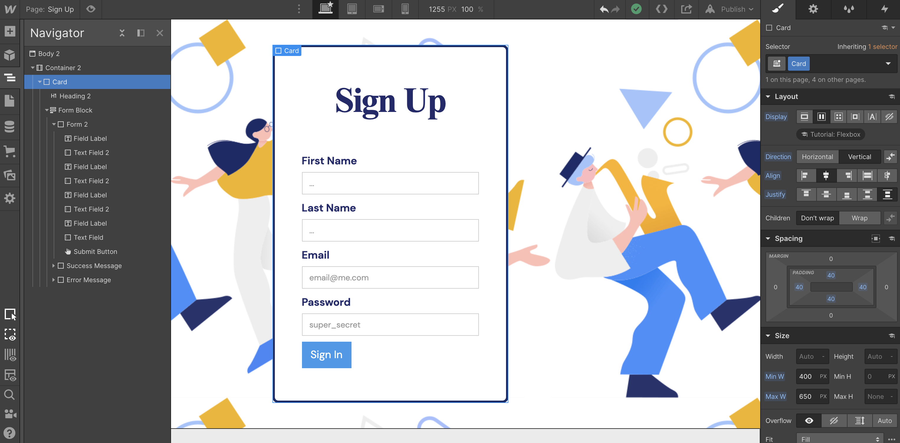
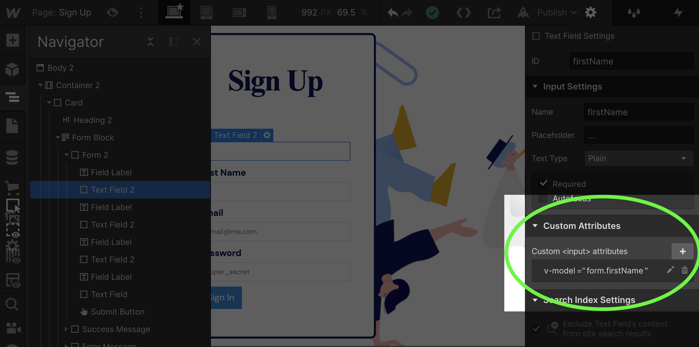
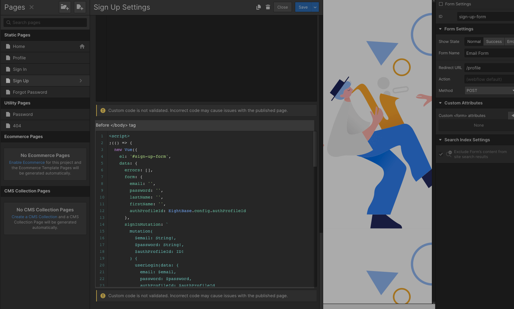
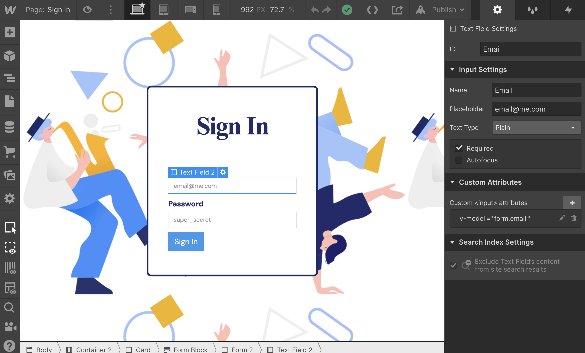

# Authenticating Users on Webflow

Authentication is a core requirement to almost all applications - as well as a core frustration to most teams! Regardless, in this tutorial we're going to implement a strategy for letting users sign up, sign in, sign out, and recover passwords in Webflow. Additionally, we're going to do it all on custom Webflow pages so that you get total design control.

## Getting Set up

To get started, we're going to want to log into Webflow and create a new project or use the initial project. It doesn't matter the styling of the project! So feel free at any time to change up the way things look if you care to.

Once the new project is open, navigate to the _Project Settings > Custom Code_ tab, and first add the script tag below in the "Head Code" section.

```html
<script
  src="https://cdnjs.cloudflare.com/ajax/libs/vue/2.6.12/vue.min.js"
  crossorigin="anonymous"
></script>
```

Vue.js is a very lightweight front-end Javascript framework that we're going to be using. It will allow us to take dynamic control over certain sections of our Webflow site.

Next, we're going to be adding another script right under that last one in our "Head Code". This one is a custom script that I encourage you to read through, or you can just copy and paste in - **except for the config section!** Essentially, it is initializing a small module to that we'll be able to access anywhere on our Webflow site.

```html
<script defer>
  /* Accessible globally on webflow site */
  window.EightBase = ((config) => {
    /**
     * Helper object for handling local storage. This will allow us
     * to easily set and retrieve user data and authentication data
     * in the browser's localStorage object.
     */
    const store = {
      /* Access value in localStorage */
      get: (key) => {
        return JSON.parse(localStorage.getItem(key));
      },

      /* Set value in localStorage */
      set: (key, value) => {
        localStorage.setItem(key, JSON.stringify(value));

        return value;
      },

      /* Remove Item from localStorage */
      remove: (key) => {
        localStorage.removeItem(key);
      },

      /* Clear values from localStorage */
      clear: () => {
        localStorage.clear();
      },

      /* Helper for determining if user is authenticated */
      isAuthenticated: () => {
        let auth = JSON.parse(localStorage.getItem("auth"));

        return Boolean(auth) && Boolean(auth.idToken);
      },
    };

    /**
     * Whenever a page loads, this piece of code will look for
     * whether the current route is private (as defined in the
     * config object). If it is private and the user is not
     * authenticated, it will redirect the user to the logoutRedirect
     * route (also defined in the config object).
     */
    let isProtectedRoute = config.routes.private.some((p) =>
      window.location.pathname.match(p)
    );

    if (isProtectedRoute && !store.isAuthenticated()) {
      window.location.replace(config.routes.logoutRedirect);
    }

    /**
     * API is a module that we'll use to execute calls to
     * the 8base API. Webflow includes jQuery by default,
     * and Ajaxs will work great for a graphQL Client.
     */
    const api = {
      request: (opts = {}) => {
        return $.ajax(
          Object.assign(
            {
              type: "POST",
              url: config.endpoint,
              contentType: "application/json",
              /**
               * Unless overridden, the idToken will get retrieved
               * from localStorage before ever request and set as
               * a bearer token.
               */
              beforeSend: (xhr) => {
                var { idToken } = store.get("auth");

                xhr.setRequestHeader("Authorization", "Bearer " + idToken);
              },
            },
            opts
          )
        );
      },
    };

    return {
      config,
      store,
      api,
    };
  })({
    /**
     * CONFIG!
     *
     * This object supplies some required info to the module.
     * You're  */
    endpoint: "<PUT_YOUR_8BASE_API_ENDPOINT>",
    authProfileId: "<PUT_YOUR_8BASE_AUTH_PROFILE_ID>",
    routes: {
      loginRedirect: "/profile",
      logoutRedirect: "/sign-in",
      private: ["/profile"],
    },
  });
</script>
```

In the last part of the script, you'll see two values that read `<PUT_YOUR_8BASE_API_ENDPOINT>` and `<PUT_YOUR_8BASE_AUTH_PROFILE_ID>`. We're going to replace those with values we'll find in 8base. The values in the `routes` object are all customizable, though I recommend leaving them as-is for the sake of this tutorial.

Let's go ahead and quickly grab those two values from 8base. Log in to the [8base console](https://app.8base.com) and open up an existing or new workspace. On the dashboard of the workspace, you'll see a card containing your API Endpoint. Copy and paste it to the `<PUT_YOUR_8BASE_API_ENDPOINT>` value in the config object.



Next, navigate to the _App Services > Authentication_ page in 8base and create a new _Authentication Profile_. Select the default "8base Authentication" option as well as "Open to all". Finally, in the _Roles_ section select "Guest" and click create.

What we're configuring here is how our users are going to authenticate. More about the specific [settings can be found here](https://docs.8base.com/docs/8base-console/authentication). However, with these settings, we're saying that 1) anyone with an email address can sign up; and 2) a user is assigned the "Guest" role when they sign up.



Once the Authentication Profile is created, it will display an idea in the far left column of the table. Copy and paste it to the `<PUT_YOUR_8BASE_AUTH_PROFILE_ID>` value in the config object of the Webflow Head Code script!

Make sure to save the changes made in Webflow, and now we're ready to jump into authentication pages!

## Building a Webflow User Sign-up Page



So what we're going to do now is build a sign-up page. You can style however you like. If you look at the picture above, that's what mine looks like. That said, there are a few really important things that need to happen for this to work.

To leverage Vue.js, we'll be adding some custom attributes to our form elements. These attributes will essentially get mapped as values that bind our form elements to data on a Vue component. If that sentence made no sense, don't worry about it! We'll still make it work.



We need to add Custom Attributes to the form elements - as seen in the picture above. On this sign up form, we're going to be asking the user to supply their first name, last name, email, and password. Make sure that those form fields have the following Custom Attributes on them, as detailed in the list below.

**First Name**

- Attribute Name: v-model
- Attribute Value: form.firstName

**Last Name**

- Attribute Name: v-model
- Attribute Value: form.lastName

**Email**

- Attribute Name: v-model
- Attribute Value: form.email

**Password**

- Attribute Name: v-model
- Attribute Value: form.password

Once all the form fields are configured, we're going to also add a Custom Attribute to the form's submit button. This will serve to make the button's click event with a custom method, rather than submit the form.

**Submit Button**

- Attribute Name: v-on:click
- Attribute Value: signUp

Okay, great work so far. If you're not familiar with Javascript, don't let the next part intimidate you! It's pretty simple and we'll walk through what's happening.

First off, we need to give the form you just created a unique ID. So in the form element's settings, update the ID input to be `sign-up-form`. The reason we need this is that we're going to need to tell the Vue component where to mount, which will give it visibility and control over the child elements (all the inputs nested within the form).

Once that ID is updated, we're going to update the entire page with a script that goes before the body tag. The script is below and the screenshot shows exactly where the script needs to go.



Go ahead and copy and paste the script below into the page's `Before </body> tag` input field. If you want to, read the in-code comments of the script to get a better understanding of what's happening. However, once you save and publish, we'll have a working sign up page!

```html
<script>
  (() => {
    new Vue({
      // Mounts component on the element with ID sign-up-form
      el: "#sign-up-form",
      data: {
        errors: [],
        // We'll store our data in a object with the key "form"
        form: {
          email: "",
          password: "",
          lastName: "",
          firstName: "",
          authProfileId: EightBase.config.authProfileId,
        },
        // This mutation is what the gql api will use to signIn the user after signUp
        signInMutation: `
        mutation(
          $email: String!,
          $password: String!,
          $authProfileId: ID!
        ) {
          userLogin(data: {
            email: $email,
            password: $password,
            authProfileId: $authProfileId
          }) {
            success
            auth {
              idToken
              refreshToken
            }
          }
        }
      `,
        // This mutation is what the gql api will use to sign up the
        signUpMutation: `
        mutation(
          $authProfileId: ID!
          $password: String!
          $firstName: String
          $lastName: String
          $email: String!

        ) {
          userSignUpWithPassword(
            authProfileId: $authProfileId,
            password: $password
            user: {
              firstName: $firstName
              lastName: $lastName
              email: $email
            }
          ) {
            id
            createdAt
          }
        }
      `,
      },
      methods: {
        handleError(error) {
          console.log(error);
        },
        // If there are no errors after signUp, this method logs in the user
        login(result) {
          if (result.errors.length) {
            this.errors = result.errors;
            return;
          }

          /* Submit request to API */
          EightBase.api.request({
            data: JSON.stringify({
              query: this.signInMutation,
              variables: this.form,
            }),
            success: (result) => {
              EightBase.store.set("auth", result.data.userLogin.auth);
              window.location.replace(EightBase.config.routes.loginRedirect);
            },
            error: this.error,
            /* Skips auth */
            beforeSend: null,
          });
        },

        // This is the method we bound to our form button, which executes the sign up request.
        signUp(event) {
          if (event) event.preventDefault();
          if (event) event.stopPropagation();

          console.log("Logging in user...");

          /* Submit request to API */
          EightBase.api.request({
            data: JSON.stringify({
              query: this.signUpMutation,
              variables: this.form,
            }),
            success: this.login,
            error: this.handleError,
            /* Skips auth */
            beforeSend: null,
          });

          return false;
        },
      },
      watch: {
        errors(errors) {
          errors.forEach(console.log);
        },
      },
    });
  })();
</script>
```

The sign-up page is technically working at this point. However, we don't have the necessary pages for sign in, forgot password, or the profile page that will only be for authenticated users. So let's go ahead and build the rest of those pages.

## Building a Webflow User Sign-In Page



You'll see the sign-in page above. It's essentially the sign-up page, without the name fields. So, to move fast just duplicate the page or copy and paste the sign-up page into a new page called "Sign In".

Delete the First Name and Last Name inputs from your form. On this page, we're going to keep the same Custom Attributes on the email and password inputs, so there are no changes needed there. However, we need to update the Custom Attribute on the form button.

**Email**

- Attribute Name: v-model
- Attribute Value: form.email

**Password**

- Attribute Name: v-model
- Attribute Value: form.password

**Submit Button**

- Attribute Name: v-on:click
- Attribute Value: login

For the form element, update the form ID to be `sign-in-form`. This will be the unique ID that the component looks for, just like last time.

Now, we're going to update the page with a very similar script to the one we used last time. Put the code below in the page setting's `Before </body> tag` input.

```html
<script>
  (() => {
    new Vue({
      // Component mounts on the element with the ID sign-in-form
      el: "#sign-in-form",
      data: {
        errors: [],
        // Our form data gets updated with the form input values
        form: {
          email: "",
          password: "",
          authProfileId: EightBase.config.authProfileId,
        },
        // This mutation is the login mutation that will return an auth token
        query: `
        mutation(
          $email: String!,
          $password: String!,
          $authProfileId: ID!
        ) {
          userLogin(data: {
            email: $email,
            password: $password,
            authProfileId: $authProfileId
          }) {
            success
            auth {
              idToken
              refreshToken
            }
          }
        }
      `,
      },
      methods: {
        handleError(error) {
          console.log(error);
        },

        // On a successful login, we save the auth token in the store and then go to the login route
        handleSuccess(result) {
          if (result.errors && result.errors.length) {
            this.errors = result.errors;
            return;
          }

          EightBase.store.set("auth", result.data.userLogin.auth);
          window.location.replace(EightBase.config.routes.loginRedirect);
        },

        // The login method is tied to the click event on our form's button
        login(event) {
          if (event) event.preventDefault();
          if (event) event.stopPropagation();

          /* Submit request to API */
          EightBase.api.request({
            data: JSON.stringify({
              query: this.query,
              variables: this.form,
            }),
            success: this.handleSuccess,
            error: this.handleError,
            /* Skips auth */
            beforeSend: null,
          });

          return false;
        },
      },
      watch: {
        errors(errors) {
          errors.forEach(console.log);
        },
      },
    });
  })();
</script>
```

## Building a Webflow User Forgot Password Page

Finally, we have our forgotten password page! As seen above...we're down to 1 input now. So let's move forward as we did with the last to pages. Copy the form over to a new page called "Forgot Password".

The custom attributes that we're going to need to add to the form elements are below. Additionally, we'll want to update the form ID on this page to `forgot-password-form`.

**Email**

- Attribute Name: v-model
- Attribute Value: form.email

**Submit Button**

- Attribute Name: v-on:click
- Attribute Value: handleSubmit

This is the most simple form of all. Submitting it will send a password reset email. However, to make all the magic happen, we're going to need to add our script! So let's add the code below in the page setting's `Before </body> tag` input.

```html
<script>
  (function () {
    new Vue({
      // Component mounts on the element with the ID sign-in-form
      el: "#forgot-password-form",
      data: {
        errors: [],
        form: {
          email: "",
          authProfileId: EightBase.config.authProfileId,
        },
        // The gql mutation to trigger the reset password email
        query: `
        mutation($authProfileId: ID!, $email: String!) {
          userPasswordForgot(data: {
            email: $email,
            authProfileId: $authProfileId
          }) {
            success
          }
        }
      `,
      },
      methods: {
        handleError(error) {
          console.log(error);
        },

        // If the call was successful, we navigate back to the logoutRedirect route
        handleSuccess(result) {
          if (result.errors && result.errors.length) {
            this.errors = result.errors;
            return;
          }

          window.location.replace(EightBase.config.routes.logoutRedirect);
        },

        // The submit handler attached to our form button.
        handleSubmit(event) {
          if (event) event.preventDefault();
          if (event) event.stopPropagation();

          /* Submit request to API */
          EightBase.api.request({
            data: JSON.stringify({
              query: this.query,
              variables: this.form,
            }),
            success: this.handleSuccess,
            error: this.handleError,
            /* Skips auth */
            beforeSend: null,
          });

          return false;
        },
      },
      watch: {
        errors(errors) {
          errors.forEach(console.log);
        },
      },
    });
  })();
</script>
```

## Wrapping up Authenticating Users on Webflow

Nice work! We've successfully set up a sign in, sign up, and forgot password pages on our Webflow site. This encompasses a pretty complete authentication flow. So, how do we test it out?

Quickly create a new page call "Profile" and publish it. If you remember at the beginning of this tutorial, we added the private route `"/profile"` to our config object. If you try to navigate to this page. You will see that the site doesn't let you access it. The browser will keep redirecting you to the sign-in page. This is because it knows you are not authenticated.

So now go ahead and either sign up or sign in. After successfully authenticating, you'll be redirected to the profile route!

How do we set up an awesome profile page and let user's log out? Coming soon...
