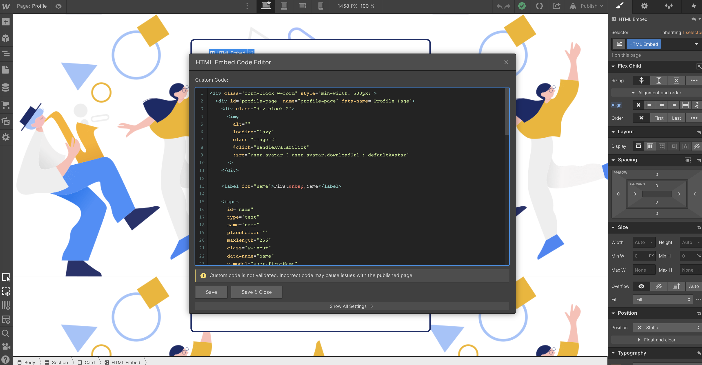
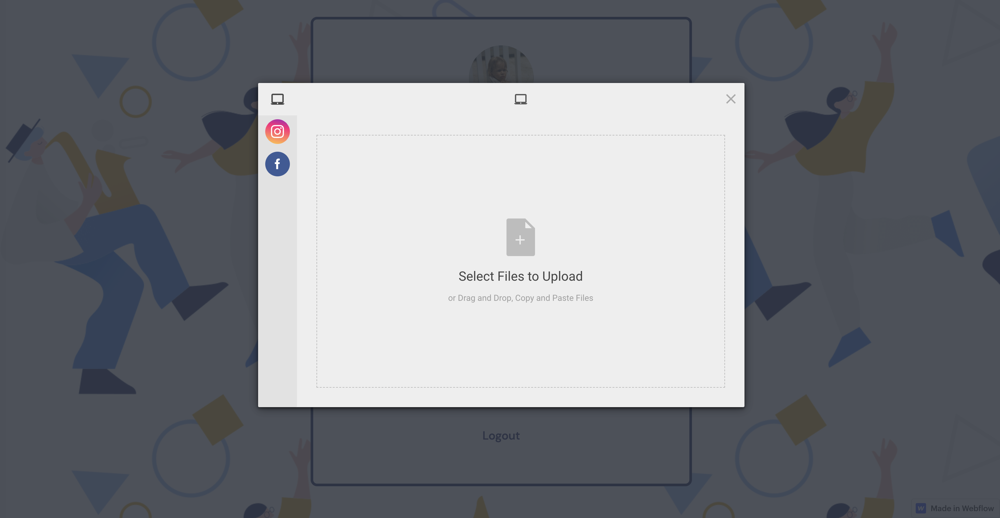

# User Profiles in Webflow

In the first section of this tutorial we covered how to set up user authentication on Webflow using an 8base backend. This tutorial is a Part 2 of the 8base + Webflow series **so please complete [Setting up Authentication on Webflow](https://www.8base.com/blog/setting-up-user-profiles-and-authentication-on-webflow) before proceeding**!

## A quick recap from authentication on Webflow 

In Part 1 we added some custom code to the `head` script of our Webflow site. The first script imported via CDN is the Vue.js framework while the other adds a custom `Eightbase` module to our site globally that we'll be able to access from any page.

Like last time, I encourage you to read through the scripts simply as a refresher. However, we're essentially initializing a small module that we'll use to handle some routing concerns and interface with the brower's `localStorage` API.

Also, we'll also be adding in the Filestack CDN to help us handle file uploads!

```html
<!-- FILESTACK CDN -->
<script src="https://static.filestackapi.com/v3/filestack.js "></script>

<!-- VUEJS CDN -->
<script src="https://cdnjs.cloudflare.com/ajax/libs/vue/2.6.12/vue.min.js"></script>

<!-- GLOBAL EIGHTBASE MODULE -->
<script defer>
  /* Accessible globally on webflow site */
  window.EightBase = (config => {
    /**
     * Helper object for handling local storage. This will allow us
     * to easily set and retrieve user data and authentication data
     * in the browser's localStorage object.
     */
    const store = {
      /* Access value in localStorage */
      get: key => {
        return JSON.parse(localStorage.getItem(key))
      },

      /* Set value in localStorage */
      set: (key, value) => {
        localStorage.setItem(key, JSON.stringify(value))

        return value
      },

      /* Remove Item from localStorage */
      remove: key => {
        localStorage.removeItem(key)
      },

      /* Clear values from localStorage */
      clear: () => {
        localStorage.clear()
      },

      /* Helper for determining if user is authenticated */
      isAuthenticated: () => {
        let auth = JSON.parse(localStorage.getItem('auth'))

        return Boolean(auth) && Boolean(auth.idToken)
      }
    }

    /**
     * Whenever a page loads, this piece of code will look for
     * whether the current route is private (as defined in the
     * config object). If it is private and the user is not
     * authenticated, it will redirect the user to the logoutRedirect
     * route (also defined in the config object).
     */
    let isProtectedRoute = config.routes.private.some(p =>
      window.location.pathname.match(p)
    )

    if (isProtectedRoute && !store.isAuthenticated()) {
      window.location.replace(config.routes.logoutRedirect)
    }

    /**
     * API is a module that we'll use to execute calls to
     * the 8base API. Webflow includes jQuery by default,
     * and Ajaxs will work great for a graphQL Client.
     */
    const api = {
      request: (opts = {}) => {
        return $.ajax(
          Object.assign(
            {
              type: 'POST',
              url: config.endpoint,
              contentType: 'application/json',
              /**
               * Unless overridden, the idToken will get retrieved
               * from localStorage before ever request and set as
               * a bearer token.
               */
              beforeSend: xhr => {
                var { idToken } = store.get('auth')

                xhr.setRequestHeader('Authorization', 'Bearer ' + idToken)
              }
            },
            opts
          )
        )
      }
    }

    return {
      config,
      store,
      api
    }
  })({
    /**
     * !!!CONFIG!!!
     *
     * This object supplies some required info to the module.
     * You're  
     */
    endpoint: '<PUT_YOUR_8BASE_API_ENDPOINT>',
    authProfileId: '<PUT_YOUR_8BASE_AUTH_PROFILE_ID>',
    routes: {
      loginRedirect: '/profile',
      logoutRedirect: '/sign-in',
      private: ['/profile']
    }
  })
</script>
```

If you see the `!!!CONFIG!!!` section of the last script, there are some key settings that we'll now want to add to our script. 

1. The `routes.private` value is an array where we can declare all our protected paths (routes where a user must be authenticated to access). 
2. If someone has not authenticated and trys to navigate to `/profile`, they will automatically get redirected to the `routes.logoutRedirect` path. 
3. After someone authenticates, the are sent to the `routes.loginRedirect` path.

You can absolutely customize these based on your own routes and site flow. That said, please use the ones suggested here for the sake of the tutorial!

## Creating a user profile page on Webflow

We now know that after a user successfully authenticates they'll be redirected to the `routes.loginRedirect` path which in our case is `/profile`. So let's go ahead and create a new page in Webflow called *Profile*. 

Now, we actually have two options when it comes to how we want to construct our profile page. The first option is by using Webflows visual design tools. The second option is by using Webflow's HTML Embeded Code Editor.

Since we used the visual design tools in Part 1 of this tutorial, let's use the HTML Embed this time around. Plus, using the HTML Embed actually allows us greater control over our layout and component.



So go ahead and add an HTML Embed component to your new *Profile* page. Once done, you'll need to add some code to it! The snippit below is one that I developed and recommend you use.

```html
<div class="form-block w-form" style="min-width: 500px;">
  <!-- 
    Unique ID for our HTML div.
   -->
  <div id="profile-page" name="profile-page" data-name="Profile Page">
    <div class="div-block-2">
      <!-- 
        - :src -
        If the user has an avatar, use the avatar.
        If not, use the default avatar

        - @click -
        When the element is clicked, call the 
        handleAvatarClick method.
       -->
      
    </div>

    <label for="name">First&nbsp;Name</label>

    <!-- 
      - v-model -
      Tags with v-model directive dynamically map the declared
      object key to the data object in the component.
     -->
    <input
      id="name"
      type="text"
      name="name"
      placeholder=""
      maxlength="256"
      class="w-input"
      data-name="Name"
      v-model="user.firstName"
    />

    <label for="name-2">Last&nbsp;Name</label>
    <input
      type="text"
      maxlength="256"
      name="name-2"
      data-name="Name 2"
      placeholder=""
      id="name-2"
      class="w-input"
      v-model="user.lastName"
    />

    <label for="email">Email</label>
    <input
      type="email"
      maxlength="256"
      name="email"
      data-name="Email"
      placeholder=""
      id="email"
      required="required"
      class="w-input"
      v-model="user.email"
    />

    <label for="Bio">Bio</label>
    <textarea
      placeholder="Tell us about yourself..."
      maxlength="5000"
      id="Bio"
      name="Bio"
      data-name="Bio"
      class="w-input"
      v-model="user.bio"
    ></textarea>

    <label for="email-2">Roles</label>
    <ul role="list">
      <!-- 
        - v-for -

        This v-for directive iterates over an array of items
        and creates an html element for eact

        - :key -

        Each element in a v-for loop requires a unique key.

        - v-text -

        The text or string value given to v-text will be displayed
        within the list item element.
       -->
      <li v-for="role in user.roles.items" :key="role.id" v-text="role.name" />
    </ul>

    <!-- 
      @click

      When save button is clicked, a method called
      updateUserData will be called.
     -->
    <input
      type="submit"
      value="Update"
      data-wait="Please wait..."
      class="w-button"
      @click="updateUserData"
    />
  </div>
</div>
```

If you look at the various HTML tags, you'll see them having attributes like `v-model`, `v-for`, `@click`, and others. These are all *directives* that provide instructions specifically to the Vue components we create. In Webflow's UI, they are called the *Custom Attributes* and you're probably use to adding them! However, unlike when using *Custom Attributes*, Webflow isn't validating our inputs or code. This gives us more options for when it  comes to writing components that use special directives.

Now, our template will do nothing without a component script to power it. So what we're going to do is add a custom script right before the body tag of our *Profile* page. That script is below. I added some comments throughout it so that you can get a good idea of what each part accomplishes.

```js
;(function () {
  new Vue({
    // 
    //Component mounts on our div with the ID "profile-page"
    //
    el: '#profile-page',
    data: {
      errors: [],
      //
      // This is what our user data object looks like.
      //
      user: {
        id: '',
        bio: '',
        email: '',
        lastName: '',
        firstName: '',
        avatar: undefined,
        roles: {
          items: []
        }
      },
      //
      // Required credentials for uploading images.
      //
      fileUploadInfo: {},
      //
      // If the user doesn't have an avatar, we'll use this default one.
      //
      defaultAvatar:
        'https://thumbs.dreamstime.com/b/default-avatar-profile-image-vector-social-media-user-icon-potrait-182347582.jpg',
      // 
      // Our query for getting the user data
      //
      query: `
        query {
          user {
            id
            bio
            email
            lastName
            firstName
            roles {
              items {
                id
                name
              }
            }
            avatar {
              downloadUrl
            }
          }

          fileUploadInfo {
            policy
            signature
            apiKey
            path
          }
        }
      `,
      //
      // Our mutation for updating the user data.
      //
      mutation: `
        mutation($data: UserUpdateInput!) {
          userUpdate(data: $data) {
            id
          }
        }
      `,
      //
      // Avatar update mutation
      //
      updateAvatarMutation: `
        mutation($userId: ID!, $fileId: String!, $filename: String!) {
          userUpdate(data: {
            id: $userId
            avatar: {
              create: {
                public: true,
                fileId: $fileId,
                filename: $filename, 
              }
            }
          }) {
            avatar {
              downloadUrl
            }
          }
        }
      `
    },

    computed: {
      //
      // Formats the form data for a profile update
      //
      form () {
        var form = Object.assign({}, { data: this.user })

        delete form.data.roles
        delete form.data.avatar

        return form
      }
    },

    methods: {
      //
      // Gets the user data from the API and sets it as 
      // the current user data.
      //
      getUserData () {
        EightBase.api.request({
          data: JSON.stringify({ query: this.query }),
          success: result => {
            this.user = result.data.user
            this.fileUploadInfo = result.data.fileUploadInfo
          }
        })
      },
      //
      // Perform update on user data.
      //
      updateUserData (event) {
        if (event) event.preventDefault()
        if (event) event.stopPropagation()

        EightBase.api.request({
          data: JSON.stringify({
            query: this.mutation,
            variables: this.form
          }),
          success: this.getUserData
        })
      },
      //
      // Open file viewer on avatar click.
      //
      handleAvatarClick () {
        //
        // Initialize the filestack SDK
        //
        const client = filestack.init(this.fileUploadInfo.apiKey, {
            security: {
                policy: this.fileUploadInfo.policy,
                signature: this.fileUploadInfo.signature
            }
        });
        //
        // Open the picker using appropriate file upload options
        //
        client.picker({
          fromSources: ["local_file_system", "instagram", "facebook"],
          storeTo: {
              location: 's3',
              path: this.fileUploadInfo.path
          },
          onFileSelected: file => {
            if (file.size > 1000 * 1000) {
                throw new Error('File too big, select something smaller than 1MB');
            }
          },
          onUploadDone: this.updateUserAvatar
        }).open();
      }, 
      //
      // After file is uploaded, update the user with the record.
      //
      updateUserAvatar (result) {
        const file = result.filesUploaded[0]

        EightBase.api.request({
          data: JSON.stringify({
            query: this.updateAvatarMutation,
            variables: {
              fileId: file.handle,
              userId: this.user.id, 
              filename: file.filename
            }
          }),
          success: result => {
            if (result.errors) {
              alert('Upload failed! ', result)
              console.log(result)
              return;
            }

            this.user.avatar = {
              downloadUrl: result.data.userUpdate.avatar.downloadUrl
            }
          }
        })
      },
      //
      // Logout the user (we'll perform a Logout from the profile page)
      //
      logout (event) {
        if (event) event.preventDefault()
        if (event) event.stopPropagation()

        EightBase.store.clear()

        window.location.replace(EightBase.config.routes.logoutRedirect)

        return false
      }
    },
    //
    // Go fetch the user data once the API
    // is created.
    //
    mounted () {
      this.getUserData()
    }
  })
})();
```

## Conclusion

Once saved, go ahead and publish your website! Given the work we did in Part 1, everything should now be working. 

As you'll see, your information will get loaded into the profile inputs on page load - which you can update using the save button after making changes. However, you can also click on your avatar to update your profile picture! Per usual, the clues on how this is getting accomplished are in the code comments.



There our two things that I'd like to share before we wrap this up. The first is that there is a TON of things that we didn't cover. For example, error handling, expired auth tokens, dynamic URLs, and a lot more. That's because this tutorial is really intended to be a proof of concept that web-applications with complex front-end logic and a professional application backend can be built on Webflow - with little compromise. The sky is the limit when it comes to where you want to take it from here!

That said, what if you're not comfortable with Javascript or HTML code? Well, the low-code/no-code industry is still at a point where some technical capabilities are necessary when it comes to build custom web-applications. That said, this tutorial can serve as a valuable example to a developer you might hire to help you on your project. While systems like Webflow are extremely popular, it is not common knowledge that a modern Javascript framework like Vue.js can be used to power dynamic front-end experiences on it. 

If you found this tutorial helpful, please let us know! And if you have any questions, please use the comments or reach out to us at [8base](https://www.8base.com).
